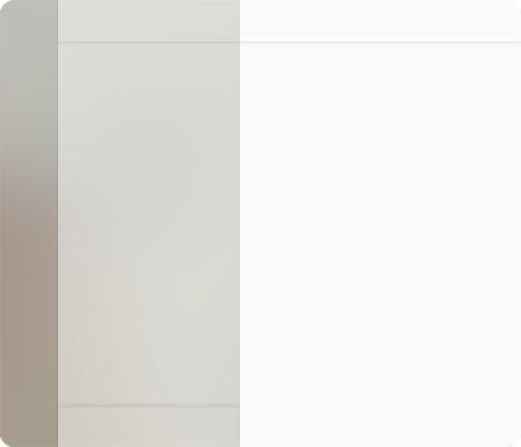

# Discord GNOME Theme

A GNOME theme for Discord, following the Adwaita style & GNOME Human Interface Guidelines (with whatever the Discord CSS lets me do).

## Requirements

1. Vesktop

   Recommended for enabling the Discord's custom titlebar. Enable with Settings > Vesktop Settings > "Discord Titlebar".

   You can still use something else like BetterDiscord - the theme will work but without the usual GNOME headerbar and with BetterDiscord content unthemed.

2. Install [Discord Adblock](https://codeberg.org/ridge/Discord-AdBlock)

   Removes Nitro elements, as they will look out of place.

3. Settings > Language > Choose "English (US)"

   This allows for custom icons due to how they are identified in Discord. You may [localize](./src/global/icons.scss) the theme, but read the localization note.

4. Settings > Plugins > Enable "ThemeAttributes"

   This allows for icons in the settings dialog.

## Theming philosophy

The theme may not fully confine to the HIG because of Discord's either CSS or design limitations or my own choices.

These are not supported:

- Discord experiments

  I do not work for Discord, so I have no way of knowing if these experiments are getting changed, deprecated, etc., i.e. maintenance burden — I maintain several other projects

- Nitro

  Exceptions — anything accessible with the FakeNitro plugin.

You \*can\* open an issue about any of these, but it's only getting fixed if it's an easy fix, i.e. missing icon.

## Installation

### No configuration

Copy the following into the text box located in Settings > Themes > Online Themes:

```
https://raw.githubusercontent.com/ricewind012/discord-gnome-theme/master/gnome.theme.css
```

### Including [configuration](#configuration)

Put [gnome.theme.css][css-file] in ~/.config/vesktop/themes. It's still
updated automatically.

## Configuration

### Transparent sidebar

<picture>
	<source srcset="assets/preview/transparent-sidebar-dark.png" media="(prefers-color-scheme: dark)">
	<source srcset="assets/preview/transparent-sidebar-light.png" media="(prefers-color-scheme: light)">
	
</picture>

1. Get the [Blur my Shell][ext-blur-my-shell] extension
2. In the extension's settings, go to Pipelines > Manage Effects > Add the "Corner" effect. Click on the effect, set "Radius" to 17.

   The Adwaita window corner radius for windows is 15, but setting it to said number will not _fully_ round them. 17 looks good on all windows.

   If the corners stick out, in [Rounded Window Corners Reborn][ext-rounded-window-corners] settings, turn up "Corner Smoothing".

3. In theme's [CSS file][css-file] set `--option-transparent-sidebar` to `true`.

Settings used for the screenshot were: radius - 100, brightness - 1.00.

<br style="clear: right;" />

## Preview


[css-file]: ./gnome.theme.css
[ext-blur-my-shell]: https://github.com/aunetx/blur-my-shell
[ext-rounded-window-corners]: https://github.com/flexagoon/rounded-window-corners
